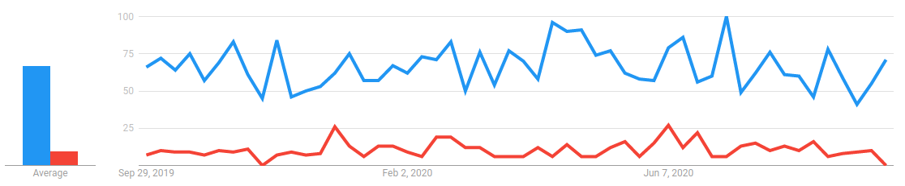

What better way to start a blog than by making a post about how you made it?

# Research

There's a lot of different methods to create a blog. Some are harder than others, some provide more features, ... Choosing one can be quite the task. I started of by listing a couple of things that are important to me.

## Important factors

- Easy (free 😃) to host
- Content is markdown, I've had a bad experience migrating out of Confluence in the past. I want to avoid vendor lock in.
- Content is managed in Git. Pretty diffs!
- Automatable. I don't want to FTP over files or something. I want to push to git and have it deployed for me.
- Something fairly "low tech". I want to write markdown, not code.

So, what platform should we use? I looked at a couple. I already had some experience tinkering around with static site generators so I am drawing from past experience here.

- Ghost

Looks really nice but requires running a server somewhere to render pages. I would prefer this being fully static which makes hosting a lot simpler.

- VuePress

Used it before for [CSMM docs](https://docs.csmm.app/). Easy to work with. Outputs simple static pages, renders from plain markdown. Solid option, but would like to explore others

- Gatsby

Looks nice, but too complicated. I just want to write some stuff and have it appear online. This is definitely a good option if you are looking to set up a more advanced site than mine.

- Medium

Meh, not a fan. You do not own your own content. They have the registration-wall now, I despise having my content subject to that.

- Jekyll

Easy hosting with Github Pages (However, Vercel/Netlify/... probably provide better UX), many themes available, pretty 'low tech'. Jekyll is also very customizable, you can really go crazy if you dig in.

- Hugo

Similar to Jekyll. Honestly, I didn't really see any obvious differences between the two.

At this point, I was set on using either Jekyll or Hugo. Since I didn't see any advantage over one or the other, I decided to look at which one is more popular on Google 😄.



Looks like Jekyll is more popular, let's give it a whirl!

# Setting up Jekyll

Installing Jekyll is pretty straight forward. Simply follow the instructions in their [quick start guide](https://jekyllrb.com/docs/) and you've got a working site! The site is pretty bare bones at this point, so I started looking for a nice theme. There's literally hundreds of options. I'm bad at deciding so I just picked one of the first ones that looked decent which happened to be [Minimal Mistakes](https://mmistakes.github.io/minimal-mistakes/). The docs for this theme are pretty great. Configuring the theme was just a matter of following the docs and changing what I wanted to be different.

# Deploying

Github pages can be used for this. It's free and easy to use, however you are limited in what Jekyll plugins you can run. You also have to configure something to build your site and commit it to a special branch. It's a lot of setup and I'm lazy. Instead, I've opted to go with Vercel for deployments. Vercel is super easy to setup and also provides deploy previews and some other nice features. In the past, I've used Netlify which is also great but I wanted to give Vercel a try.

## Setting up deployments with Vercel

Log in, click through their wizard. Easy peasy. Afer this, you will get an autogenerated URL where your site is live. You probably want to use your own domain instead! For Vercel - like most of these static site builders - the solution to this is to create a CNAME record in your DNS that points to their servers. You add your own domain in the settings page and their servers make sure that people see the right content when they surf to your site.

There's one small caveat for this if you use Cloudflare like I do. You either have to disable the Cloudflare proxy feature or do some configuration so Vercel can access the `.well-known` folder. (I think this is to support creating SSL certificates via ACME but I might be making stuff up 🙉) Considering there is no real benefit to keeping the Cloudflare proxy active in this case, I just disabled it. For more info on this topic, see [Vercel docs](https://vercel.com/knowledge/using-cloudflare-with-vercel)

# Extending Jekyll some more

So one of the cool things with Jekyll is that there is a huge community behind it creating tooling, plugins, themes and other cool stuff. I decided to explore this a bit, not too much though! It's easy to get lost in all the cool stuff you can add but I wanted to start out simple and build on top of it.

## [HTML proofer](https://github.com/gjtorikian/html-proofer)

Search engines penalize your site if you have dead links on it. So let's check the whole site every few days for those, right? Yeah, right. Let's automate this 🙂. HTML proofer is a simple utility that checks the output of your Jekyll build for mistakes or errors.

Installing it is as easy as adding it to your Gemfile, running your build and then running `html-proofer`.

```sh
bundle exec jekyll build
bundle exec htmlproofer ./_site
```

This is still too much manual work for me though, so I created a Github Action workflow to run it automatically on every git push.
