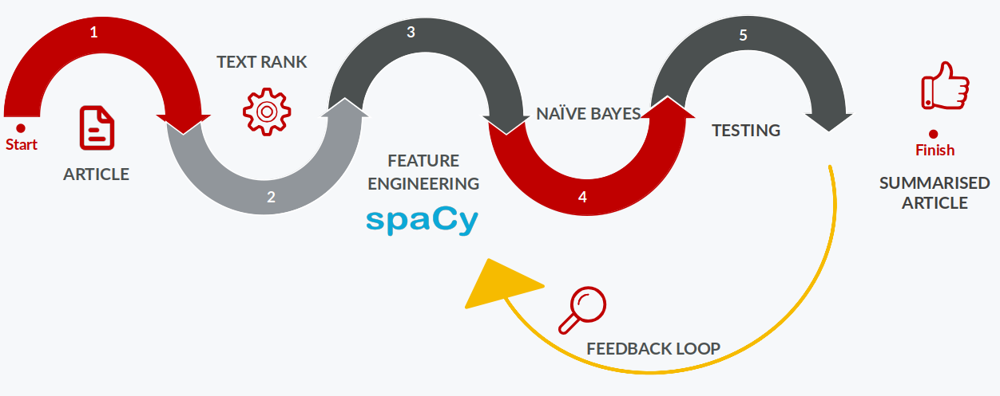
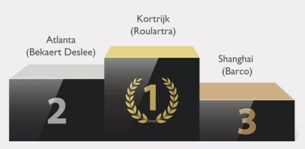

The [Delaware student games](https://www.delaware.pro/en-be/events/delaware-student-game-2021) are an annual event where students get 24 hours to work on a real-life case.

//TODO:
TLDR: Check our pitch video!

## Our case

The case we got was from [Roularta media group](https://www.roularta.be/en/). In our modern times, many people don't have time to read full articles of text anymore. There's information overload and people want to read the gist of an article and then decide if they want to keep reading. Roularta wants to use modern techniques to create summaries of articles to make this possible.

- Use natural language processing (NLP) to create **extractive** summaries
- A limited dataset (100 articles total, 75 of those had a expected outcome summary)
- Only work with Dutch articles.
- 24 hours to make something awesome!

## Our solution

2/3ths of our technical team were web developers and had very little experience with AI/ML, let alone NLP. This meant that the first hours involved a **lot** of Googling.

We had a few ideas on what we could do, but first we had to do some tests to see if those ideas were viable or not.

One of the ideas we had was to use [GPT-3](https://en.wikipedia.org/wiki/GPT-3). GPT-3 at this point is well known for being a really powerful deep learning language model. We got access to the private beta via a friend (Thanks Andreas!) and played around. After being thoroughly amazed we decided that we couldn't use GPT-3 because it creates **abstractive** summaries while the challenge explicitly asked for **extractive** summaries. The difference between these two, in a nutshell, is that an abstractive summary will rewrite parts of the origin text while extractive summaries will select certain sentences from the origin text without modifying anything. Generally, this means that an extractive summary will look more like bullet points, while an abstractive summary will be more of a coherent text.

We starting looking for other options and came up with a few promising leads, namely [Hugging Face](https://huggingface.co/) and [SpaCy](https://spacy.io/). These libraries are super powerful but they are very dependent on the strength of the underlying model. Since we were limited to only working with Dutch articles and Dutch models are less developed than English ones, we wanted to figure out a way to make our solution better.

Together with our business teammates we came up with a plan of action. We were going to create a pipeline to run an article through several steps, resulting in a summary at the end.

### TextRank

[TextRank](https://web.eecs.umich.edu/~mihalcea/papers/mihalcea.emnlp04.pdf) is an algorithm that can pick out important sentences in an article. It's a very complex algorithm but in a (very tiny) nutshell, it works by looking at the frequency of words. If a word appears many times in an article, it's probably important and should be included in the summary.

TextRank is language independent. It doesn't 'comprehend' the text, which makes it a good fit for our Dutch articles. A downside of TextRank is that it cannot be trained to become better over time. We will use TextRank to create a ~10 sentence summary, after which we will feed this temporary summary into the rest of our model.

### Feature engineering with SpaCy

The next step in the pipeline is to do [feature engineering](https://en.wikipedia.org/wiki/Feature_engineering). By defining our custom features, we can use this to create a more focused model, tailored to our use case. During the challenge we defined some basic features like length of a sentence, average length of words in the sentence and also started on some more advanced ones like detecting verbs, nouns, locations, dates,... inside the text. Time was a limiting factor here, but if this solution is further developed we can come up with a lot more features to further improve the model.

### Naive Bayes classifier

Armed with our newly created features, we trained a [naive Bayes classifier](https://en.wikipedia.org/wiki/Naive_Bayes_classifier) to do the final filtering of the summary. At this point we reduce the ~10 sentences returned from TextRank to ~5 sentences.

### Measuring success

We have arrived at the end of our pipeline! The question now remains: is what we made any good? To measure this, we used [ROUGE](https://www.freecodecamp.org/news/what-is-rouge-and-how-it-works-for-evaluation-of-summaries-e059fb8ac840/). It provides us with values for Recall and Precision and allows us to calculate F1 scores.

The summary resulting from TextRank gave us a F1 score of 34%. After running the full pipeline, the F1 score went up to 40%. That's a 6% increase which isn't ground breaking but it does show that our later steps make for a better summary. By collecting feedback, creating more and fine-tuning the features, iterating on the model we can continuously improve it until we get _perfect_ summaries.

## Conclusion

The case we got was very interesting and challenging. Most of our team had very little NLP experience and I learned a ton. I feel like we created something really cool and hopefully useful to Roularta and Delaware.

We even managed to walk away with first place!

Of course, I'd like to thank my teammates [Emiel Van Severen](https://www.linkedin.com/in/emielvanseveren/), [Florian Van Daele](https://www.linkedin.com/in/florian-vd/), [Chloë Fabri](https://www.linkedin.com/in/chlo%C3%AB-fabri/) and [Tibo Vanleke](https://www.linkedin.com/in/tibo-vanleke-66b9a01b4/) for a wonderful collaboration and our coaches [Charlotte De Vlieghere](https://www.linkedin.com/in/charlotte-de-vlieghere/), [Arthur Vande Weghe](https://www.linkedin.com/in/arthur-vande-weghe-121518151/) and [Frank Devliegher](https://www.linkedin.com/in/frankdevliegher/) for coaching us to a victory :)

You can find our code scattered in different repos. [My repo](https://github.com/niekcandaele/delaware-student-games) includes a few testing notebooks and a python web API which we used during the pitch. Inside the API folder, you'll find `pickle` files containing our model. My teammate Emiel created the [front end of the pitch demo](https://github.com/emielvanseveren/NLP) which uses the Python API from my repo
