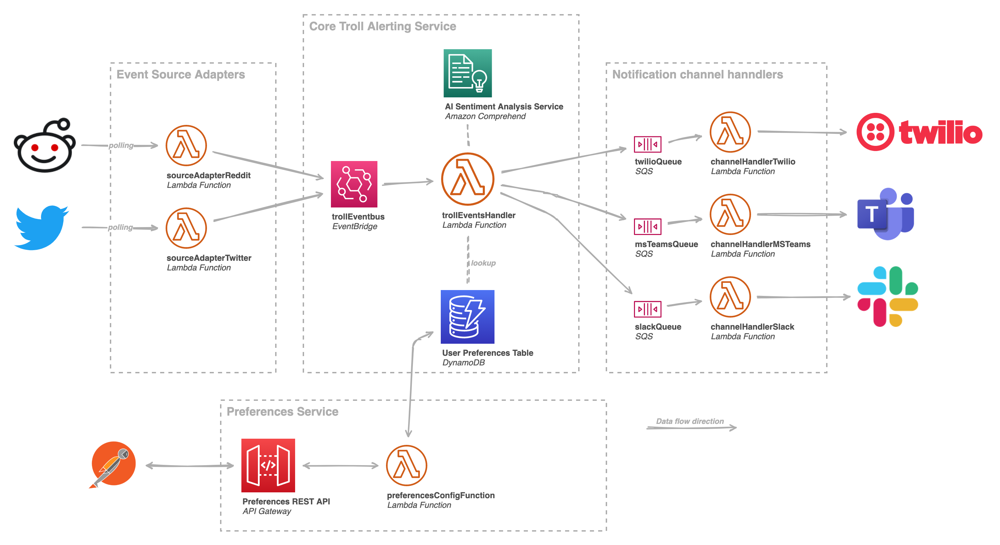

[Hack the future](https://hackthefuture.be) is a Belgian hackathon aimed at last year students. There are challenges in many different domains ranging from security to NLP to Google Cloud platform. We (my teammate Emiel and I) registered for the AWS challenge.

## Preparation

So starting off we had a very small amount of information about the challenge itself, we knew we had to make _some_ monitoring and alerting system.

> The Fellowship saw the devastations it has caused. The darkness of the code already clouded the minds of so many innocent souls. Peasants behaving like trolls, raging without a clear vision, and abandoning any form of decency! The code's area of influence is increasing by the minute. Massive new flare-ups are being detected on diverse social media platforms.

This is a very broad description so all we really did was to brush up on some AWS concepts like Lambda, S3 and SQS. We did this by creating a quick prototype/playground with the [Serverless framework](https://www.serverless.com/).

## The challenge

### Overview

[Empty repo with the assignment](https://github.com/I8C/htf-alerting-service-empty)



Let's start off by explaining what we were building. The entire application is divided into four sections.

1. Event source adapters

These are lambda functions that scrape/request data from different social media platforms. This data is then sent into the next section via EventBridge

2. Core troll alerting service

All the scraped data arrives here. We previously pushed the data into EventBridge which then triggers a new lambda.

We perform sentiment analysis on it via [Amazon Comprehend](https://aws.amazon.com/comprehend/). After that, we check the preferences table and send out appropriate notifications by pushing data into SQS.

3. Preferences service

This one was not that well defined, I think mostly because this was considered an 'extra' and likely nobody would get this far. The purpose of this service is to control what notifications go to who. So for example we could configure that a user wants all positive sentiment events go to Slack while all negative or neutral sentiment events go to Discord.

4. Notification channel handlers

This is where the finalized data arrives and is then sent out to the different notification channels. These lambdas are triggered by SQS queues.

### Our solution

I will talk about this section from my perspective. My teammate Emiel did a lot of work as well but I was too busy solving the challenge to pay attention to what he was doing.

Let's start by talking about **how** we worked. We set up a [VS Code LiveShare](https://docs.microsoft.com/en-us/visualstudio/liveshare/use/vscode) session so that we can both work on the same files and not have to worry about Git branching, pushing and pulling. This workflow worked great for this AWS challenge because all the code is very disconnected. If I was making syntax errors in the lambda I was working on, Emiel has no issues in another lambda.

I started off by taking a look at all the files in the repo and quickly realized we were not using the Serverless framework but AWS SAM instead. No biggie, that only means the Cloudformation templates will be different. At this point Emiel had finished the few set up steps we had to do in the AWS console so I started deploying our (for now) empty lambdas, just as a test to see if everything is functional before we start changing things.

After that I started looking into the Reddit adapter, this code was really straight forward to get working. All it took was looking at some docs from the [Snoowrap](https://www.npmjs.com/package/snoowrap) library to know what needed to happen. We decided to get the top hourly posts of [/r/worldnews](https://www.reddit.com/r/worldnews/).

With the Reddit adapter running, I started to look at the `trollEventsHandler`. Again, the code for this was not complicated. We did not start the preferences service yet so we just jammed the data we got from the Reddit adapter into Amazon Comprehend and then both datasets (sentiment and Reddit data) into all currently existing SQS queues. I think Emiel had already created these.

At this point, our system was _almost_ functional. We had the Reddit source, the `trollEventsHandler` and the notification channel handlers. The only problem was that when the Reddit lambda was triggered, no events were being sent to our notification channels.

So far, all of this seems like a very straight forward connect-the-dots experience. Let me tell you: it wasn't. I spent a lot of time triggering lambdas and then checking Cloudwatch monitoring to see if events actually went through or not and checking Cloudwatch log groups to see if any of our lambdas were erroring. At this point, a massive thank you to one of our coaches, Samuel, who showed us that EventBridge has a `default` bus and then others we should use for the challenge. I had spent way longer than I want to admit trying to figure out why events were not coming through on the default bus.

So now we have a functional system right? Haha, nope and we have about an hour and a half before the hackaton finished. When I triggered the Reddit lambda, nothing showed up in the notification channels still.

**What the heck?** _Many debugging attempts here, mostly wrestling the AWS console into submission and getting it to show what I wanted to see_

You might think an hour and a half is plenty of time but when our debugging efforts failed for about 75 minutes, that becomes a lot less comfortable.

```
// TODO: Paste code pushing events to EventBridge
```

Turns out that while we use promises with the AWS SDK here, if an error occurred, the Promise would not reject! It would resolve with an error message. Again a thank you to our coach for saving the day and telling us to save the response to a variable and log it. As it turns out, EventBridge accepts JSON but not all JSON.

// TODO: Paste error message here? Was a weird error iirc

You cannot push an array of events into EventBridge. During this time of lockdowns, this was probably one of the most exhilarating moments I experienced. We found this fix about 10-15 minutes before the end of the challenge. I jumped out of my chair with joy while at the same time trying to code the fix (Didn't work very well 😉). In hindsight, this issue was probably causing tons of other weird behavior which we tried to debug. If we had just logged the ~~damned~~ response at the start, this would have saved us **so much** time.

Finally we had a working system!

## Aftermath

We won. gg ez
