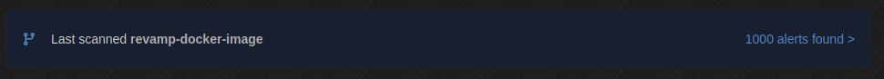
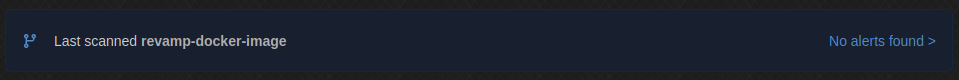

This year I (virtually) attended [Dockercon](https://docker.events.cube365.net/docker/dockercon/) and [Snykcon](https://snyk.io/snykcon/) and I learned a lot of interesting stuff about Docker! For my open source project [CSMM](https://github.com/CatalysmsServerManager/7-days-to-die-server-manager) we already had a Docker image and workflows. However, those were set up a long time ago and hadn't been touched for a while. More importantly, I set that up when I was starting off with Docker. There were a lot of things wrong with it or things that could be added/improved.

Let's take a look at the original Dockerfile

```Dockerfile
FROM node:10

# Create app directory
WORKDIR /usr/src/app
RUN chown -R node:node /usr/src/app
USER node

# Install app dependencies
# A wildcard is used to ensure both package.json AND package-lock.json are copied
# where available (npm@5+)
COPY package*.json ./

RUN npm ci --only=production

# Bundle app source
COPY --chown=node:node . .

HEALTHCHECK --interval=10s --timeout=2s --start-period=10s --retries=3 CMD [ "node", "/usr/src/app/scripts/healthcheck.js" ]

# Install 7d2d item icons
RUN bash /usr/src/app/scripts/itemIconsUpdate.sh

EXPOSE 1337
CMD [ "npm", "run", "start" ]
```

There were a couple of problems with it

- Still using node 10, node 15 has been released already!
- Using the `node:10` image which is based on Debian. The container size is 539.89 MB
- Lots of security issues and bad hygiene

Let's dive in and make some improvements!

## Snyk security scanning

Snyk is a tool that can automatically scan your code and find security vulnerabilities. I used this to do an initial scan of the current image we had.



1000 alerts! Holy. That result shocked me at first but when I actually looked at the reports I saw a lot of CVEs that were not applicable to CSMM. Stuff like ImageMagick and all the other software included in Debian.
Some of them probably were a problem but I wasn't going to go through all those reports to check if they should be fixed. Besides, how would I _**fix**_ them?

## Alpine based image

So the problem really is that the Debian based image has too much surface area. It's a full blown operating system with all the bells and whistles. That's not needed for a container, so I decided to switch to a minimal base image. Enter [Alpine Linux](https://www.alpinelinux.org/). The Alpine image is only 39.02 MB when compressed while the original image weighed in at **332.78 MB**. That ~300MB difference represents SO MUCH included software (which we probably don't use).

Switching to an Alpine based image was as easy as changing `FROM node:10` to `FROM node:10-alpine`. If you decide to make this change, you have to keep in mind that Alpine uses [musl-libc](https://musl.libc.org/) which can cause issues with certain software depending on their `libc` usage.

I also decided to update to node 14, since we don't even test 10 anymore in CI. `FROM node:14-alpine`.

After this, I let Snyk scan the image again



## Multi stage build

If you use a Debian based image to build your container, you likely do not need to install additional dependencies because Debian already includes so much. However, we've now switched to an Alpine based image, so we don't have everything preinstalled anymore! This is a problem because for our application, we need `curl` to load some data during build phase.

Easily fixed right? Just use the package manager to install it.

`RUN apk --no-cache add curl`

But now curl is included in the final image, including software we do not use during runtime is what we wanted to avoid! We could add an extra command to uninstall the package again. What if we need a new dependency later on? Will we remember to add the uninstall line?

A better solution is to use a multi stage build. There's [good documentation about this feature](https://docs.docker.com/develop/develop-images/multistage-build/) but essentially it boils down to doing all the build steps in one container and then moving only the necessary files (i.e. the built application files) to another container which will be the final product. This way we can install all the dependencies we want during build and not have to worry about leftover files.

So how do we implement this?

```Dockerfile
# The build image. We give this container a name so we can reference it later on
FROM node:14-alpine AS builder

# Do all the build stuff here
# apk add, ./build.sh, npm run build, go wild!

# Here we start working in a fresh container
FROM node:14-alpine

# Copy the built files from the builder into the runtime container
COPY --from=builder /usr/src/app .

# Runtime container stuff here
# HEALTHCHECK, EXPOSE, things like that
```

## CI

In the original CI flow, all we did was run the Docker build, give it a tag and push it to Dockerhub. We can do more now. Let's start by adding the Snyk scanning to our CI.

```yml
- name: Run Snyk to check Docker image for vulnerabilities
  # Snyk can be used to break the build when it detects vulnerabilities.
  # In this case we want to upload the issues to GitHub Code Scanning
  continue-on-error: true
  uses: snyk/actions/docker@master
  env:
    SNYK_TOKEN: ${{ secrets.SNYK_TOKEN }}
  with:
    # Pass the locally built image to Snyk
    image: catalysm/csmm:${{ "{{ steps.prep.outputs.version " }}}}
    args: --file=Dockerfile
```

This action is pretty straight forward. We use the prebuilt action from Snyk for this. We have to configure an API key from Snyk as a Github secret `SNYK_TOKEN: ${{ "{{ secrets.SNYK_TOKEN " }}}}`.

One line that may make you go 🤔 is `image: catalysm/csmm:${{ "{{ steps.prep.outputs.version " }}}}`. This is a reference to the locally built image. We always want to scan the newly built image vs an image that is already uploaded.

## Hadolint

As software developer, you are likely already familiar with the concept of linting. While we typically use linting to check our production code for errors or best practices, we can also use a linter on our Dockerfile! The tool I used is [Hadolint](https://github.com/hadolint/hadolint).

Adding Hadolint to our workflow is easy:

```yml
- name: Run Hadolint
  run: docker run --rm -i hadolint/hadolint < Dockerfile
```

# Wrapping up

You can view all the changes I described in this post in a [pull request](https://github.com/CatalysmsServerManager/7-days-to-die-server-manager/pull/431). You might notice that in this blog post I talking about adding things in a different order than I did in the PR. You can also see me struggling a bit to get things working properly :).

I hope this blog post has shown you some nice additions to your current Docker workflows.
